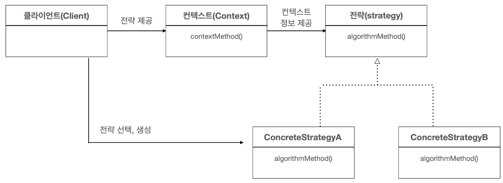
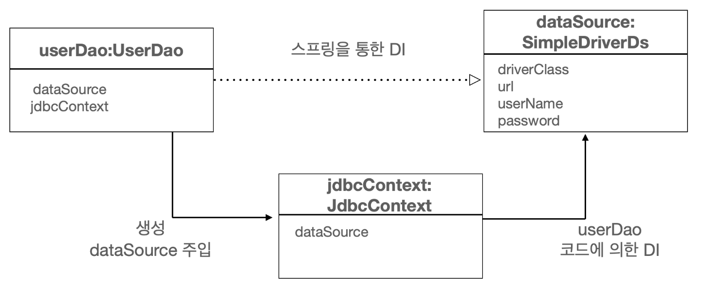

# 템플릿
> 템플릿이란 바뀌는 성질이 다른 코드 중에서 변경이 거의 일어나지 않으며
> 일정한 패턴으로 유지되는 특성을 가진 부분을 자유롭게 변경되는 성질을 가진 부분으로
> 독립시켜서 효과적으로 활용할 수 있도록 하는 방법
> 
> 간단하게 말하면 변하지 않는 부분과 변하는 부분을 분리하는 것

```text
[SOLID의 개방 폐쇄 원칙 (OCP)]
개방 폐쇄 원칙이란 어떤 부분은 변경을 통해 그 기능이 다양해지고 확장하려는 성질이 있고,
어떤 부분은 고정되어 있고 변하지 않으려는 성질이 있음을 의미한다

변화의 특성이 다른 부분을 구분해주고, 각각 다른 목적과 다른 이유에 의해 다른 시점에 독립적으로
변경될 수 있는 효율적인 구조를 만들어주는 것이 개방 폐쇄 원칙이다.
```

## 템플릿 메소드 패턴
템플릿 메소드 패턴은 상속을 통해 기능을 확장해서 사용하는 패턴. 변하지 않는 부분은 슈퍼 클래스에 두고
변하는 부분은 추상 메소드로 정의해둔다음 서브클래스에서 오버라이드하여 새롭게 정의해서 쓰도록 하는 것

템플릿 메소드 패턴은 장점도 있지만 개인적으로 생각하는 큰 단점은 책에서 설명하듯, 서브클래스들이 이미 클래스
레벌에서 컴파일 시점에 관계가 결정되어 있는 것이다. 이 경우 그 관계에 대한 유연성이 떨어져 버린다.

## 전략 패턴
전략패턴은 오브젝트를 아예 둘로 분리하고 클래스 레벨에서는 인터페이스를 통해서만
의존하도록 만든다. 전략패턴은 OCP 관점에 보면 확장에 해당하는 변하는 부분을 별도의
클래스로 만들어 추상화된 인터페이스를 통해 위임하는 방식이다. 

전략 패턴에 따르면 Context가 어떤 전략을 사용할 것인가는 Context를 사용하는 앞단의 Client가 
결정하는 것이 일반적이다. Client가 구체적인 전략의 하나를 선택하고 오브젝트로 만들어서 Context에 전달하는 것이다.



- Client
  - 전략을 생성하거나 선택하고 Context에 제공하는 역할
  - Context를 호출하는 책임을 지고 있음

- Context
  - 변하지 않는 부분을 분리한 클래스나 메소드
  - Client에게 전달받은 전략을 호출하는 책임을 지고 있음 
  - Context는 Strategy의 구현체는 알지 못함

- Strategy 
  - 변하는 부분을 추출하여 추상화한 클래스
  - Context가 전략을 실행하는데 사용하는 방법이 선언되어 있음 (인터페이스의 method)

- ConcreteStrategy
  - 추상화된 전략의 구현체 
  - Context가 사용할 다양한 알고리즘을 구현

```text
마이크로 DI

DI가 매우 작은 단위의 코드와 메소드 사이에서 일어나는 경우를 의미함
DI의 장점을 단순화해서 IoC 컨테이너의 도움 없이 코드 내에서 적용한 경우를 마이크로 DI라고도 한다.
또는 코드에 의한 DI라는 의미로 수동 DI라고 부를 수도 있다.

** DI의 가장 중요한 개념은 제3자의 도움을 통해 두 오브젝트 사이의 유연한 관계가 설정되도록 만든다는 것
때문에 DI를 돕기위한 새로운 역할이 추가되지 않거나 IoC 컨테이너가 사용되지 않더라도 제 3자의 도움을 통해
유연한 관계가 만들어지면 DI가 이뤄지고 있음을 알 수 있다. 
```

## 로컬 클래스
**[ 개인적인 생각 ]**

전략패턴의 단점 (전략이 추가될 때마다 새로운 구현체가 추가되는 문제)를 해결하기 위해 로컬 클래스를 이용할 수 있다.
그런데 로컬 클래스는 개인적으로 단점을 해결하기 위해 좋은 방법이 아닌 것 같다는 느낌이 든다. 

일단 전략패턴은 클래스가 추가되더라도 클라이언트 코드가 간결하기 때문에 읽기 수월하다는 장점이 있었는데
로컬 클래스 같은 경우에는 내부 클래스여서 자신이 선언된 곳의 정보를 가져올 수 있다는 장점과 
클래스 파일이 추가되지 않는다는 장점이 있어도 클라이언트 코드가 너무 더렵혀진다는 느낌이 든다. 
불필요한 내부 클래스 생성이라는 생각도 들었다.

```text
이 글을 정리하고 나서 다시 생각해보니 전략 패턴 기준에선 UserDao가 클라이언트지만 UserDao를 사용하는 다른 어플리케이션 오브젝트 기준에서는
UserDao의 내부 구현을 알 필요가 없으니 로컬 클래스를 이용한 해결 방법도 좋은 해결법이라는 생각이 들었다.
````

## 익명 내부 클래스
내부 클래스를 생성할 거라면 익명 내부 클래스로 생성하는 방법도 좋은 방법이다.
익명 내부 클래스는 클래스 선언과 오브젝트 생성이 결합된 형태로 만들어지기 때문에 이름을 갖지 않는다.
상속할 클래스나 구현할 인터페이스를 생성자 대신 사용해서 다음과 같은 형태로 만들어서 사용한다.

익명 내부 클래스는 클래스를 재사용할 필요가 없고 구현한 인터페이스 타입으로만 사용할 경우에 유용하다.

- 예시
  - new 인터페이스 이름() {클래스 본문};

## 의존관계 주입
의존관계 주입 개념을 충실히 따르면 인터페이스를 사이에 두어 런타임 시에 의존할 오브젝트와의 관계를
다이나믹하게 주입하는 것이 맞다. 따라서 인터페이스를 사용하지 않으면 온전한 DI라고 보기 힘들다. 그러나
스프링읠 DI는 IoC라는 개념을 포괄하기 때문에 객체의 생성과 관계설정 권한을 오브젝트에서 제거하고
외부로 위임했다면 DI의 기본을 따르고 있다고 볼 수 있다.  

## 코드를 이용하는 수동 DI
스프링 빈으로 등록되지 않은 클래스가 스프링 빈을 필요로 한다면 
해당 클래의 생성과 관리를 담당하는 클래스에게 DI까지 맡기면 해결이 가능하다.  
오브젝트를 생성하고 그 의존 오브젝트를 수정자 메소드로 주입해주는 것이 바로 DI의 동작원리이기 때문에
이 행위를 대신해줄 클래스가 존재하면 된다. 




## 템플릿과 콜백
전략 패턴의 기본 구조에 익명 내부 클래스만 활용한 방식을 스프링에서는 `템플릿/콜백 패턴`이라고 부른다.
`전략 패턴의 컨텍스트를 템플릿`이라고 부르고 `익명 내부 클래스로 만들어지는 오브젝트를 콜백`이라고 부른다.

앞에서 내부 클래스 개선 방식을 비판했는데.. 이것을 위한 빌드업이었구나 라는 생각이 든다.

### 템플릿
- 템플릿은 어떤 목적을 위해 미리 만들어둔 모양이 있는 툴
- 프로그래밍에서는 고정된 틀 안에 바꿀 수 있는 부분을 넣어서 사용하는 경우에 템플릿이라고 부름
- 템플릿 메소드 패턴은 고정된 틀의 로직을 가진 템플릿 메소드를 슈퍼 클래스에 두고, 바뀌는 부분을 서브 클래스에 두는 구조로 이뤄짐

### 콜백
- 콜백은 실행되는 것을 목적으로 다른 오브젝트의 메소드에 전달되는 오브젝트를 말한다.
- 파라미터로 전달되지만 값을 참조하기 위한 것이 아니라 특정 로직을 담은 메소드를 실행 시키기 위해 사용된다.
- 자바에선 메소드 자체를 파라미터로 전달할 방법은 없기 때문에 메소드가 담긴 오브젝트를 전달해야한다. 그래서 `Functional Object`라고도 한다.

### 템플릿/콜백의 특징
- 여러개의 메소드를 가진 일반적인 인터페이스를 가진 전략패턴과 달리 템플릿/콜백 패턴의 콜백은 단일 메소드 인터페이스를 사용한다.
  - 템플릿의 작업 흐름 중 특정 기능을 위해 한번 호출되는 경우가 일반적이기 때문에
  - 하나의 템플릿에서 여러 가지 전략을 사용해야 한다면 하나 이상의 콜백 오브젝트를 사용할 수 있음
- 콜백은 일반적으로 하나의 메소드를 가진 인터페이스를 구현한 익명 내부클래스로 만들어진다고 보면 된다.

### 템플릿/콜백의 흐름


1. 템플릿에서 사용할 콜백 오브젝트를 생성
2. 콜백 오브젝트를 전달함과 동시에 템플릿 메소드 호출
3. 정해진 작업 흐름에 따라 작업 시작
4. 콜백 메소드를 호출하기 위한 참조정보 생성
5. 콜백 메소드 호출과 동시에 참조정보 전달
6. 클라이언트에서 선언된 변수 참조 (callback 오브젝트가 내부 클래스로 선언되었을 경우)
7. 콜백 메소드의 작업 수행
8. 콜백 메소드 작업 결과 반환
9. 정해진 작업 이어서 수행
10. 작업 마무리
11. 템플릿 작업 결과를 클라이언트에게 반환


**스프링에서 주로 사용하는 JdbcTemplate 도 템플릿/콜백 패턴으로 이뤄져 있음**


### 테스트 보완
- 현명한 개발자가 되려면 부정적인 자세가 필요하다. (부정적인 상황에 대한 검증)
- 개발자는 어떻게 해야 자신의 코드가 정상적으로 돌아가는지 안다. 때문에 예외상황에 대한 테스트가 부족할 수 있다.
  - 정상적인 상황 뿐만 아니라 예외 상황에 대한 검증이 필요함
- 예외 상황에 대한 테스트를 자주 뺴먹는다면, 정상적인 테스트보다 먼저 예외적인 상황에 대한 테스트를 작성하는 습관을 들이는 것도 방법


## 3장 정리
- 일정한 작업 흐름이반복되면서 그중 일부만 바뀌는 코드가 존재하면 전략 패턴을 고려해본다.
  - 바뀌지 않는 부분은 컨텍스트, 바뀌는 부분은 전략으로 만들고 인터페이스를 통해 유연하게 전략을 변경할 수 있도록 구성
- 같은 애플리케이션 안에서 여러 가지 종류의 전략을 다이나믹하게 구성하고 사용해야 한다면 컨텍스트를 이용하는 클라이언트 메소드에서 직접 전략을 정의하고 제공하게 만든다.
- 컨텍스트가 하나 이상의 클라이언트 오브젝트에서 사용된다면 클래스를 분리해서 공유하도록 만든다.
- 단일 전략 메소드를 갖는 전략 패턴이면서 익명 내부 클래스를 사용해서 매번 전략을 새로 만들어 사용하고, 컨텍스트 호출과 동시에 전략 DI를 수행하는 방식을 템플릿/콜백 패턴이라고 한다.
- 콜백의 코드에도 일정한 패턴이 반복된다면 콜뱀을 템플릿에 넣고 재활용하는 것이 편리하다.
- 스프링을 JDBC 코드 작성을 위해 jdbcTemplate 를 기반으로 하는 다양한 템플릿과 콜백을 제공한다.
- 템플릿은 한 번에 하나 이상의 콜백을 사용할 수도 있고, 하나의 콜백을 여러 번 호출할 수도 있다.
- 템플릿/콜백을 설계할 떄는 템플릿과 콜백 사이에 주고받는 정보에 관심을 둬야 한다. 


